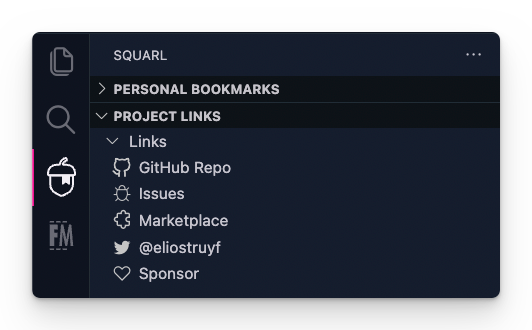

<p align="center">
  
</p>

<h1 align="center">Squarl Bookmarks</h1>

<h2 align="center">Bookmark important files and/or links for your projects.</h2>

<p align="center">
  <a href="https://marketplace.visualstudio.com/items?itemName=eliostruyf.vscode-squarl" title="Check it out on the Visual Studio Marketplace">
    
  </a>

  
  
  

  <a href="https://github.com/sponsors/estruyf" title="Become a sponsor" style="margin-left:10px">
    
  </a>
</p>

## Why Squarl Bookmarks

Every project has various dependencies, not only the onces we use to code, but also the once around the project. Like: task lists, project management, documentation, ...

In most cases, you share this information of which platforms and/or systems used with your team. What if you can bring it closer to the project? 

This is the purpose of Squarl Bookmarks to allow you and your team to create and share these bookmarks. Instead of opening your browser, looking for the project bookmark, and navigating to it. You can now add the bookmark in your project and navigate instantly from within Visual Studio Code to it. 

You can use Squarl Bookmarks to store bookmarks personally (in VS Code `.vscode/settings.json` or the global user settings) or with your team (via a `squarl.json` file).

## Features

The extension comes with the following features:

- Add files or links to your bookmarks list
- Search through all the bookmarks in your list
- Create groups
- Deleted project files are shown in a seperate group

## How to use it

The intention of the Squarl Bookmarks extension is to allow you to be able to quickly navigate to any of your important project files or links.

You can use the extension for personal or team purposes.

### Personal

When you install the extension, and open the Squarl Bookmarks panel. You will see the welcome view with the ability to add a file or link.

<p align="center">
  
</p>

Another way to add a file or link to your bookmarks list, is to use one of the commands:

- Squarl: Bookmark link (`squarl.bookmark.addLink`)
- Squarl: Bookmark file (`squarl.bookmark.addFile`)

Once you've added bookmarks, the view will be updated to the bookmarks list view.

<p align="center">
  
</p>

> **Note**: Global bookmarks are stored in the Visual Studio Code global user settings, the project bookmarks are stored in the `.vscode/settings.json` file of the current project.


### Team

For team bookmarks, you'll need to create the team file, you can do this manually by creating a `squarl.json` file in the current project, or with the **Squarl: Initialize team file** (`squarl.team.init`) command.

Once the file is created, you can add your **groups** and **bookmarks** to it.

Initial file content:

```json
{
  "name": "Team bookmarks",
  "groups": [],
  "bookmarks": []
}
```

The object structure of the [group](#group-item) and [bookmark](#bookmark-item) items is the same as that of you personal bookmarks.

It is a manual process to add the groups and bookmarks to the file.

Once this file contains bookmarks, a team bookmarks view will appear.


<p align="center">
  
</p>

## Commands

The extension has the following commands for you to make use:

<!-- COMMANDS -->

## Settings

The extension uses the following settings to manage the behavior:

<!-- SETTINGS -->

### Bookmark item

Bookmark items contain the following properties:

- **name**: Name of the bookmark
- **path**: Relative path to the file or URL
- **description**: Description for your bookmark (optional)
- **type**: `file` or `link`
- **groupId**: ID of the group (optional)
- **iconName**: Name of the icon to set for the link (optional)

Example:

```json
{
  "name": "Bookmark title",
  "path": "<relative path to file> or <link>",
  "description": "Bookmark description",
  "type": "file|link",
  "groupId": "group",
  "iconName": "bookmark"
}
```

### Group item

Group items contain the following properties:

- **id**: ID of the group
- **name**: Name of the group

Example:

```json
{
  "id": "group",
  "name": "Group"
}
```

## Contributors ✨

<p align="center">
  <a href="https://github.com/estruyf/vscode-squarl/graphs/contributors">
    
  </a>
</p>

## Contributing / Issues / feedback

If you want to contribute, you are more than welcome to do so. Feel free to start by opening an issue on the project repository in order to track the changes.

If you find a bug, or have some feedback, let us know by opening an issue in the project repository.

👉 [Navigate to the issue list](https://github.com/estruyf/vscode-squarl/issues).

## Changelog / Release notes

[CHANGELOG](./CHANGELOG.md)

## License

[MIT](./LICENSE)

<br />
<br />

<p align="center">
  <a href="https://visitorbadge.io">
    
  </a>
</p>